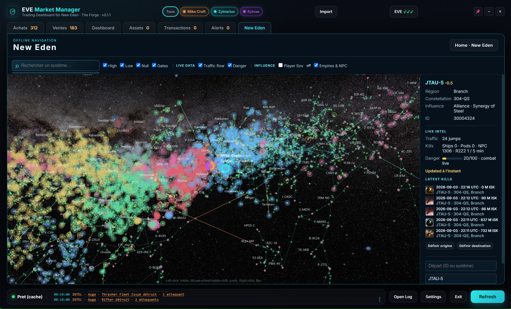

# EVE Market Manager

[](https://www.python.org/)
[](https://opensource.org/licenses/MIT)
[](https://developers.eveonline.com/)
[](https://www.sqlite.org/)

**EVE Market Manager** is a fast, modern desktop application designed for EVE Online market traders. It connects directly to the EVE ESI API and local market export logs to analyze, monitor, and optimize your market orders across multiple characters in real-time.


---

## Latest release: New Eden tactical map



The New Eden workspace combines CCP SDE topology with optional ESI and zKillboard/R2Z2 live intel. It remains usable offline: live layers are additive and never block the map.

## Key features

- **Multi-character ESI SSO**: Connect several EVE characters with the official OAuth2 flow.
- **Order competition analysis**: Detect outbid orders, undercuts and FIFO position across trade hubs.
- **Trend and duplicate views**: Track update workloads and self-competing orders with per-character color indicators.
- **Margin and batch tools**: Calculate net margins with station-aware broker fees and accounting taxes.
- **Resilient local storage**: SQLite WAL transactions, retry handling, single-instance lock and heartbeat.
- **New Eden 3D map**: Fixed CCP SDE coordinates, security filters, search, real stargates, safe routing and character positions.
- **Live tactical overlays**: ESI traffic and danger, R2Z2/zKillboard combat markers retained on-map for 30 minutes, sovereignty and empire influence layers. The combat stream is active only while the map is open.
- **Local analyser**: Detect a copied EVE Local roster from the Windows clipboard and open a compact pilot risk summary, independently from the trading workflow.

See [the New Eden map documentation](docs/NEW_EDEN_MAP.md) for the map data and online/offline behaviour.

---

## Installation and setup

### Prerequisites
- **Python 3.10+** (Python 3.14 compatible)
- **Windows 10/11** (uses native EdgeChromium / WebView2 engine)

### Quick Start

1. **Clone the repository**:
   ```bash
   git clone https://github.com/mdpwbe-sys/mmd-public-trader.git
   cd mmd-public-trader
   ```

2. **Install dependencies**:
   ```bash
   pip install -r requirements.txt
   ```

3. **Configure EVE Online SSO (`.env`)**:
   Copy `.env.example` to `.env` and fill in your CCP Developer credentials:
   ```env
   CLIENT_ID=your_client_id_here
   CLIENT_SECRET=your_client_secret_here
   CALLBACK_URL=http://127.0.0.1:8766/callback
   ```

4. **Launch the application**:
   ```bash
   python mmd_gui.py
   ```
   *or double-click `mmd_gui.bat`.*

---

## EVE Online developer application setup

1. Go to the [CCP Developers Portal](https://developers.eveonline.com/).
2. Click **Create New Application**.
3. Set **Connection Type** to `Authentication & API Access`.
4. Add the required Scopes:
   - `esi-ui.open_window.v1`
   - `esi-markets.read_character_orders.v1`
   - `esi-markets.structure_markets.v1`
   - `esi-universe.read_structures.v1`
   - `esi-wallet.read_character_wallet.v1`
   - `esi-markets.read_corporation_orders.v1`
   - `esi-wallet.read_corporation_wallets.v1`
   - `esi-assets.read_assets.v1`
   - `esi-assets.read_corporation_assets.v1`
   - `esi-contracts.read_character_contracts.v1`
   - `esi-contracts.read_corporation_contracts.v1`
   - `esi-corporations.read_divisions.v1`
   - `esi-characters.read_blueprints.v1`
   - `esi-characters.read_standings.v1`
   - `esi-skills.read_skills.v1`
   - `esi-location.read_location.v1` *(requested by the current MMD SSO flow; used only for active character positions on the map)*
5. Set **Callback URL** to `http://127.0.0.1:8766/callback`.
6. Copy your `Client ID` and `Secret Key` into your local `.env` file.

Station names, regions, and item names use the bundled light SDE when present.
On a clean installation, MMD resolves them through read-only ESI routes and stores only
non-sensitive caches under `%APPDATA%/MMD-Trader`; copying an existing `eve.db` is optional.
Large inventories are resolved progressively (up to 40 new market/type pairs per refresh).

---

## Testing

Run the automated test suite to verify SQLite WAL concurrency, transactional retries, and data integrity:

```bash
python tests_db.py
python test_ticks.py
```

---

## License and disclaimer

Distributed under the **MIT License**. See `LICENSE` for details.

*EVE Online and the EVE logo are the registered trademarks of CCP hf. All rights are reserved worldwide. All other trademarks are the property of their respective owners.*
